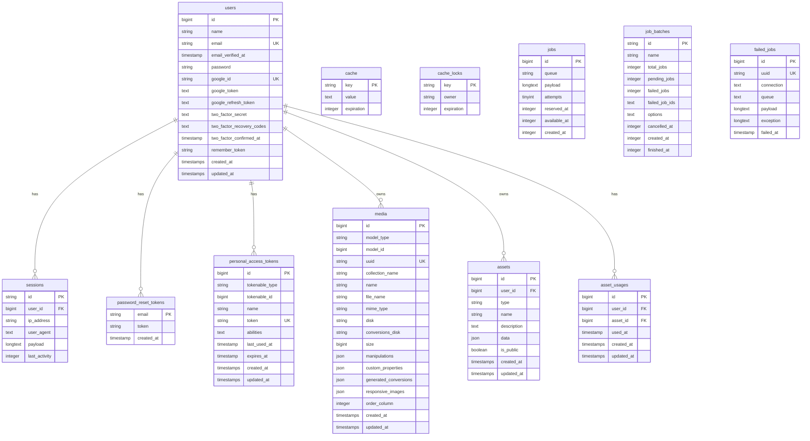

# Database Schema - Achronyme

**Versión:** 1.0
**Fecha:** 2025-10-05
**Mantenido por:** @eddndev

---

## 1. Diagrama de Relaciones (ER Diagram)



---

## 2. Tablas del Sistema

### 2.1 `users` - Usuarios del Sistema

Almacena la información de todos los usuarios registrados.

| Campo | Tipo | Null | Descripción |
|-------|------|------|-------------|
| `id` | BIGINT | NO | Primary key, auto-increment |
| `name` | VARCHAR(255) | NO | Nombre completo del usuario |
| `email` | VARCHAR(255) | NO | Email único del usuario |
| `email_verified_at` | TIMESTAMP | YES | Fecha de verificación de email |
| `password` | VARCHAR(255) | YES | Hash de contraseña (nullable para OAuth) |
| `google_id` | VARCHAR(255) | YES | ID único de Google OAuth |
| `google_token` | TEXT | YES | Access token de Google |
| `google_refresh_token` | TEXT | YES | Refresh token de Google |
| `two_factor_secret` | TEXT | YES | Secret para 2FA |
| `two_factor_recovery_codes` | TEXT | YES | Códigos de recuperación 2FA |
| `two_factor_confirmed_at` | TIMESTAMP | YES | Fecha de confirmación 2FA |
| `remember_token` | VARCHAR(100) | YES | Token de "recordar sesión" |
| `created_at` | TIMESTAMP | YES | Fecha de creación |
| `updated_at` | TIMESTAMP | YES | Fecha de última actualización |

**Índices:**
- `PRIMARY KEY (id)`
- `UNIQUE KEY (email)`
- `UNIQUE KEY (google_id)`

---

### 2.2 `sessions` - Sesiones Activas

Almacena las sesiones activas de los usuarios.

| Campo | Tipo | Null | Descripción |
|-------|------|------|-------------|
| `id` | VARCHAR(255) | NO | Session ID (primary key) |
| `user_id` | BIGINT | YES | FK a `users.id` |
| `ip_address` | VARCHAR(45) | YES | Dirección IP del usuario |
| `user_agent` | TEXT | YES | User agent del navegador |
| `payload` | LONGTEXT | NO | Datos serializados de la sesión |
| `last_activity` | INTEGER | NO | Timestamp de última actividad |

**Índices:**
- `PRIMARY KEY (id)`
- `INDEX (user_id)`
- `INDEX (last_activity)`

---

### 2.3 `password_reset_tokens` - Tokens de Recuperación

Almacena tokens temporales para reseteo de contraseña.

| Campo | Tipo | Null | Descripción |
|-------|------|------|-------------|
| `email` | VARCHAR(255) | NO | Email del usuario (primary key) |
| `token` | VARCHAR(255) | NO | Token de reseteo hasheado |
| `created_at` | TIMESTAMP | YES | Fecha de creación del token |

**Índices:**
- `PRIMARY KEY (email)`

---

### 2.4 `personal_access_tokens` - Tokens de API

Almacena tokens de acceso personal para la API (Laravel Sanctum).

| Campo | Tipo | Null | Descripción |
|-------|------|------|-------------|
| `id` | BIGINT | NO | Primary key |
| `tokenable_type` | VARCHAR(255) | NO | Tipo de modelo (polymorphic) |
| `tokenable_id` | BIGINT | NO | ID del modelo (polymorphic) |
| `name` | VARCHAR(255) | NO | Nombre descriptivo del token |
| `token` | VARCHAR(64) | NO | Token hasheado (único) |
| `abilities` | TEXT | YES | Permisos del token (JSON) |
| `last_used_at` | TIMESTAMP | YES | Última vez usado |
| `expires_at` | TIMESTAMP | YES | Fecha de expiración |
| `created_at` | TIMESTAMP | YES | Fecha de creación |
| `updated_at` | TIMESTAMP | YES | Fecha de actualización |

**Índices:**
- `PRIMARY KEY (id)`
- `UNIQUE KEY (token)`
- `INDEX (tokenable_type, tokenable_id)`

---

### 2.5 `media` - Archivos y Multimedia

Almacena metadatos de archivos subidos (Laravel Media Library).

| Campo | Tipo | Null | Descripción |
|-------|------|------|-------------|
| `id` | BIGINT | NO | Primary key |
| `model_type` | VARCHAR(255) | NO | Tipo de modelo asociado |
| `model_id` | BIGINT | NO | ID del modelo asociado |
| `uuid` | CHAR(36) | YES | UUID único del archivo |
| `collection_name` | VARCHAR(255) | NO | Nombre de la colección |
| `name` | VARCHAR(255) | NO | Nombre del archivo |
| `file_name` | VARCHAR(255) | NO | Nombre del archivo en disco |
| `mime_type` | VARCHAR(255) | YES | Tipo MIME |
| `disk` | VARCHAR(255) | NO | Disco de almacenamiento |
| `conversions_disk` | VARCHAR(255) | YES | Disco para conversiones |
| `size` | BIGINT | NO | Tamaño en bytes |
| `manipulations` | JSON | NO | Manipulaciones aplicadas |
| `custom_properties` | JSON | NO | Propiedades personalizadas |
| `generated_conversions` | JSON | NO | Conversiones generadas |
| `responsive_images` | JSON | NO | Imágenes responsive |
| `order_column` | INTEGER | YES | Orden en la colección |
| `created_at` | TIMESTAMP | YES | Fecha de creación |
| `updated_at` | TIMESTAMP | YES | Fecha de actualización |

**Índices:**
- `PRIMARY KEY (id)`
- `UNIQUE KEY (uuid)`
- `INDEX (model_type, model_id)`

---

### 2.6 `assets` - Recursos del Usuario

Almacena recursos creados por usuarios (proyectos, cálculos guardados, etc.).

| Campo | Tipo | Null | Descripción |
|-------|------|------|-------------|
| `id` | BIGINT | NO | Primary key |
| `user_id` | BIGINT | NO | FK a `users.id` |
| `type` | VARCHAR(255) | NO | Tipo de asset (fourier, convolution, etc) |
| `name` | VARCHAR(255) | NO | Nombre del asset |
| `description` | TEXT | YES | Descripción opcional |
| `data` | JSON | NO | Datos del cálculo/proyecto (JSON) |
| `is_public` | BOOLEAN | NO | Si es público o privado |
| `created_at` | TIMESTAMP | YES | Fecha de creación |
| `updated_at` | TIMESTAMP | YES | Fecha de actualización |

**Índices:**
- `PRIMARY KEY (id)`
- `FOREIGN KEY (user_id) REFERENCES users(id) ON DELETE CASCADE`
- `INDEX (type)`
- `INDEX (is_public)`

---

### 2.7 `asset_usages` - Uso de Assets

Registra el uso de assets para estadísticas.

| Campo | Tipo | Null | Descripción |
|-------|------|------|-------------|
| `id` | BIGINT | NO | Primary key |
| `user_id` | BIGINT | NO | FK a `users.id` |
| `asset_id` | BIGINT | NO | FK a `assets.id` |
| `used_at` | TIMESTAMP | NO | Timestamp de uso |
| `created_at` | TIMESTAMP | YES | Fecha de creación |
| `updated_at` | TIMESTAMP | YES | Fecha de actualización |

**Índices:**
- `PRIMARY KEY (id)`
- `FOREIGN KEY (user_id) REFERENCES users(id) ON DELETE CASCADE`
- `FOREIGN KEY (asset_id) REFERENCES assets(id) ON DELETE CASCADE`
- `INDEX (used_at)`

---

## 3. Tablas de Sistema (Laravel)

### 3.1 `cache` y `cache_locks`

Almacenan datos de caché de Laravel.

### 3.2 `jobs` y `job_batches`

Gestión de colas de trabajo asíncrono.

### 3.3 `failed_jobs`

Registro de trabajos fallidos para debugging.

---

## 4. Relaciones y Reglas de Negocio

### Relación Usuario-Asset
- **Tipo:** One-to-Many
- **Regla:** Un usuario puede tener múltiples assets
- **Eliminación:** Cascade (al eliminar usuario, se eliminan sus assets)

### Relación Usuario-Session
- **Tipo:** One-to-Many
- **Regla:** Un usuario puede tener múltiples sesiones activas
- **Eliminación:** Cascade

### Relación Asset-AssetUsage
- **Tipo:** One-to-Many
- **Regla:** Un asset puede tener múltiples registros de uso
- **Eliminación:** Cascade

---

## 5. Consideraciones de Seguridad

### Datos Sensibles
- **Contraseñas:** Hasheadas con bcrypt (cost factor 12)
- **Tokens OAuth:** Encriptados en la BD
- **2FA Secrets:** Encriptados
- **Tokens de API:** Hasheados con SHA-256

### Soft Deletes
- Actualmente no implementado, pero considerar para `users` y `assets` en el futuro

### Auditoría
- Usar `created_at` y `updated_at` para tracking básico
- Considerar implementar audit log en el futuro para cambios críticos

---

## 6. Índices y Optimización

### Índices Actuales
- Primary keys en todas las tablas
- Foreign keys indexadas automáticamente
- Campos únicos: `email`, `google_id`, `token`, `uuid`
- Campos de búsqueda frecuente: `type`, `is_public`, `used_at`

### Recomendaciones Futuras
- Composite index en `(user_id, type)` para `assets` si hay muchas consultas filtradas
- Full-text index en `name` y `description` de `assets` para búsqueda
- Particionamiento de `asset_usages` por fecha si crece demasiado

---

## 7. Migraciones Futuras (Roadmap)

### Fase 2 - Cursos y Contenido Educativo
```sql
CREATE TABLE courses (
  id BIGINT PRIMARY KEY,
  title VARCHAR(255),
  description TEXT,
  difficulty ENUM('beginner', 'intermediate', 'advanced'),
  created_at TIMESTAMP,
  updated_at TIMESTAMP
);

CREATE TABLE lessons (
  id BIGINT PRIMARY KEY,
  course_id BIGINT,
  title VARCHAR(255),
  content TEXT,
  order_column INTEGER,
  FOREIGN KEY (course_id) REFERENCES courses(id) ON DELETE CASCADE
);

CREATE TABLE user_progress (
  id BIGINT PRIMARY KEY,
  user_id BIGINT,
  lesson_id BIGINT,
  completed_at TIMESTAMP,
  FOREIGN KEY (user_id) REFERENCES users(id) ON DELETE CASCADE,
  FOREIGN KEY (lesson_id) REFERENCES lessons(id) ON DELETE CASCADE
);
```

### Fase 3 - Comunidad
```sql
CREATE TABLE comments (
  id BIGINT PRIMARY KEY,
  user_id BIGINT,
  asset_id BIGINT,
  parent_id BIGINT NULL,
  content TEXT,
  created_at TIMESTAMP,
  updated_at TIMESTAMP,
  FOREIGN KEY (user_id) REFERENCES users(id) ON DELETE CASCADE,
  FOREIGN KEY (asset_id) REFERENCES assets(id) ON DELETE CASCADE,
  FOREIGN KEY (parent_id) REFERENCES comments(id) ON DELETE CASCADE
);

CREATE TABLE likes (
  id BIGINT PRIMARY KEY,
  user_id BIGINT,
  asset_id BIGINT,
  created_at TIMESTAMP,
  FOREIGN KEY (user_id) REFERENCES users(id) ON DELETE CASCADE,
  FOREIGN KEY (asset_id) REFERENCES assets(id) ON DELETE CASCADE,
  UNIQUE KEY (user_id, asset_id)
);
```

---

**Documento vivo - Actualizado con cada migración de base de datos**